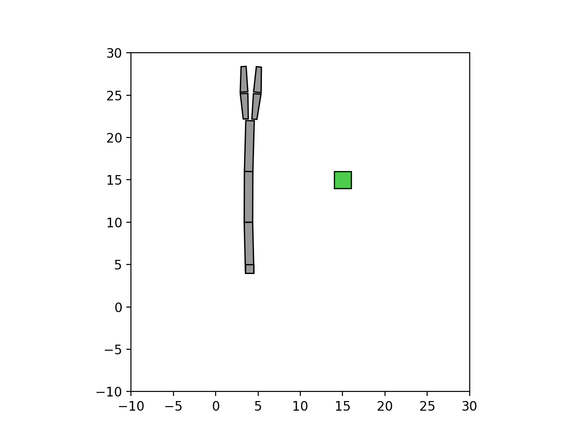
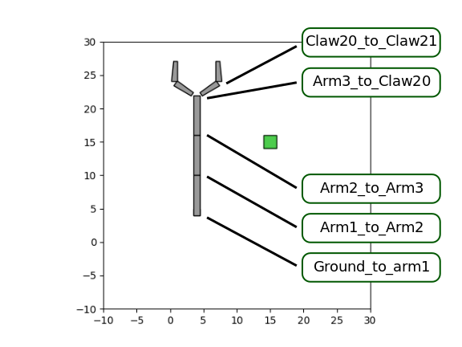

# Box2DSim

A simple [gym](http://gym.openai.com/) environment using [pybox2d](https://github.com/pybox2d/pybox2d/wiki/manual) as the physics engine and [matplotlib](https://matplotlib.org/) for graphics.

## Table of contents
* [Install](#install)
* [Basic usage](#basic-usage)

## Install

1. Download de Box2DSim repo:

       git clone https://github.com/GOAL-Robots/CNR_170608_SOURCE_box2d_simulation.git

2. Install the Box2Dsim package:

       cd CNR_170608_SOURCE_box2d_simulation
       pip install -e .

## Basic usage

### One-arm scenario

    import gym
    import box2dsim

    env = gym.make('Box2DSimOneArm-v0')

    for t in range(10):  
      env.render()
      observation = env.step(env.action_space.sample())

#### rendering

The two possible values of the argument to be passed to env.render() are:
* "human": open a matplotlib figure and update it at each call.
* "offline": save a frame into a png file at each call. Files are saved into the local folder 'frames'. This  folder is created if it does not exist.

<TABLE width="50%" BORDER="0" align="center">
<TR>
<TD>

</TD>
</TR>
<TR>
<TD>
Example in [test.py](box2dsim/examples/test.py)
</TD>
</TR>
</TABLE>

#### Actions

The action attribute of env.step must be a vector of 7 joint positions in radiants. The first 7 joints have a range between -Pi/2 and +Pi/2. The two gripper joints have a range between 0 and +Pi/2. They are also coupled so that the second joint will be at most twice the angle of the first one.

<TABLE width="100%" BORDER="0">
<TR>
<TD>

| index |  joint name               |
| ----- | ------------------------- |
|  0    |  Ground_to_Arm1           |
|  1    |  Arm1_to_Arm2             |
|  2    |  Arm2_to_Arm3             |
|  3    |  Arm3_to_Claw20           |
|  4    |  Claw20_to_Claw21         |

</TD>
<TD></TD>
</TR>
</TABLE>

#### Observations

The observation object returned by env.step is a dictionary:

* observation["JOINT_POSITIONS"] is a vector containing the current angles of the 7:w
 joints
* observation["TOUCH_SENSORS"] is a vector containing the current touch intensity at the four touch sensors (see figure below)
* observation["OBJ_POSITION"] coordinates of the center of mass of the external object

#### Reward

The reward value returned by env.step is always put to 0.

#### Done

The done value returned by env.step is always set to False.

#### Info

The info value returned by env.step is always set to an empy set {}.
  .
